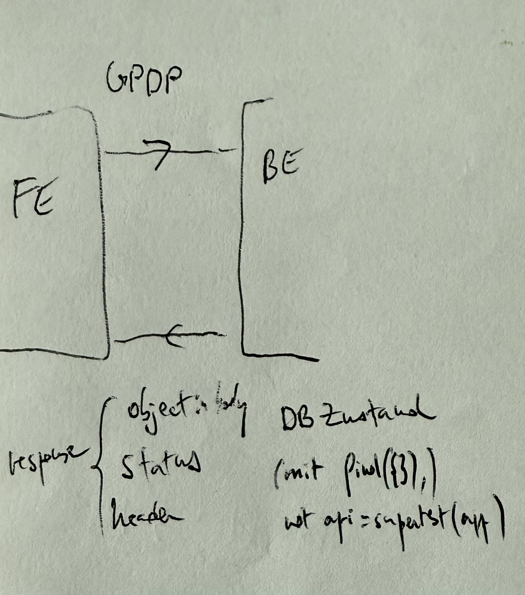
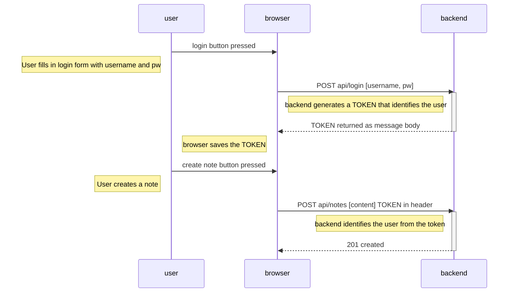
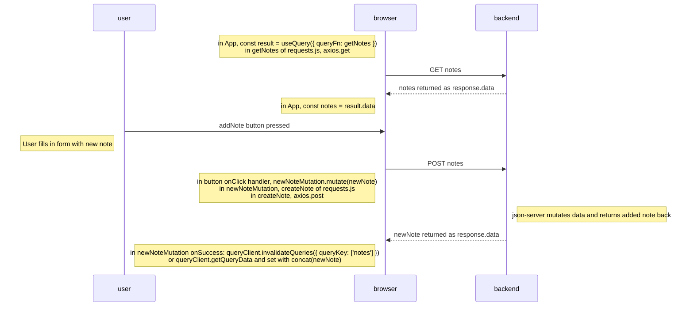

[container](#container)  
[shell](#shell)  
[js](#javascript)

https://docs.github.com/de/get-started/writing-on-github/getting-started-with-writing-and-formatting-on-github/basic-writing-and-formatting-syntax#section-links  
https://www.markdownguide.org/extended-syntax/#highlight

## Tips and tricks

encrypt a file: https://courses.mooc.fi/org/uh-cs/courses/devops-with-kubernetes/chapter-3/configuring-applications

## Kubernetes

Kubernetes: API. Orchestration system like compose, robustness and automatization, can scale number of containers  
[Templates](https://github.com/thomastoumasu/k8s-submission)  
Make cluster accessible from outside: [check](https://github.com/thomastoumasu/k8s-submission)

- GKE directly with LoadBalancer, see also app7 on MaterialExample
- with ingress (use NodePort in services)
- with gateway (use ClusterIP in services)
- also check serverless [5.7](https://github.com/thomastoumasu/k8s-submission/tree/5.7)
- setup with cloudflare: [3.8](https://github.com/thomastoumasu/k8s-submission/tree/3.8)

If app depends on another service (like backend depending on database):

- use initContainer that waits for db (busybox doing dnslookup db-svc) [example](https://github.com/thomastoumasu/k8s-submission/tree/core)
- use readyness probe
- or instead of complicated error handling/startup order, just let backend crash if db not yet available so k8s can restart the pod.

[Setting resources](https://cloud.google.com/blog/products/containers-kubernetes/kubernetes-best-practices-resource-requests-and-limits?hl=en):

- cannot set requests that are larger than the resources provided by the node
- if app uses more than available cpu, will be throttled (=worse performance), if uses more than available memory, container will be terminated.
- stateful set shuts down every time a little after starting the first pod with a sudden "NodeNotReady " message: resource capacity problem. Change the option --machine-type=e2-micro to --machine-type=e2-small

[Secrets](https://courses.mooc.fi/org/uh-cs/courses/devops-with-kubernetes/chapter-3/configuring-applications)

Be careful:

- Usually all apps need to return something on /. On GKE, use lb HealthCheckPolicy.
- Might need to change strategy from default RollingUpdate to Recreate for multiple pods accessing same pv.
- Better to keep [sidecar container](https://kubernetes.io/docs/concepts/workloads/pods/sidecar-containers/) always running (otherwise will be restarted over and over again)
- If mounting multiple pods on same folder, think: files can be deleted [5.4](https://github.com/thomastoumasu/k8s-submission/tree/5.4)

[sanity checks](https://github.com/thomastoumasu/k8s-submission/blob/core/bin/bash/core.sh) and useful commands:

```bash
docker ps
k3d kubeconfig get k3s-default
kubectl cluster-info
kubectl create namespace exercises || true
kubectl get po,deploy,svc, nodes  --all-namespaces
kubectl get all -n project
kubectl delete all --all
kubectl delete pod alpine-curl --grace-period=0 --force
# sanity check for customize:
kubectl kustomize .
kubectl apply -k .
# how much resources do the apps use
kubectl top pod -l app=backend
kubectl describe nodes > nodesStart.txt # nodes/...
# check before setting up ingress or gateway
POD=$(kubectl get pods -o=name | grep wiki)
kubectl port-forward $POD 3003:80
# sanity checks
kubectl get ing --watch # curl ADDRESS of the-project-ingress
kubectl get gateway shared-gateway -n infra # instead of get: describe
gcloud compute url-maps list
kubectl get events -n project --sort-by='.lastTimestamp'
kubectl logs --since=1h $MONGOPOD > logsMongoPodSmall.txt
kubectl logs --previous $MONGOPOD > logsMongoPodSmallFirst.txt
kubectl logs -f $POD --prefix --all-containers
kubectl rollout status deployment log-output-dep
POD=$(kubectl get pods -o=name | grep postgres) && kubectl wait --for=condition=Ready $POD
kubectl get pods $POD -o jsonpath='{.spec.containers[*].name}'
curl $(kubectl get ksvc/pingpong -o=jsonpath='{.status.url}')
curl -H "Host: log-output.exercises.172.18.0.3.sslip.io " http://localhost:8081
for i in $(seq 1 100); do curl -s http://localhost:8080 | grep Hello; done
# exec into pod
kubectl exec -it $POD -c frontend -- sh
POD=$(kubectl get pods --no-headers -o custom-columns=":metadata.name" | grep mongo) && kubectl exec -it $POD -- sh
# copy file from / into pod
kubectl cp ${POD}:dump/the_database/todos.bson ./the_project/mongo/dump/the_database/todos.bson
# debug DNS
kubectl apply -f ./manifests/curl.yaml
kubectl exec -it alpine-curl -- sh
curl http://backend-svc:2345/api/todos
curl greeter.exercises.svc.cluster.local
curl greeter.exercises.172.18.0.3.sslip.io
# with service IP
SVCIP=$(kubectl get service/backend-svc -o jsonpath='{.spec.clusterIP}')
kubectl exec -it alpine-curl -- curl ${SVCIP}:2345/api/todos
# with pod IP
POD=$(kubectl get pods -o=name | grep backend)
kubectl describe $POD
# curl this ID, with internal port (5000)
# if problem with db, debug postgres
kubectl apply -f ./manifests/busybox.yaml
kubectl exec -it my-busybox -- nslookup postgres-svc
```

## shell

https://regex101.com/  
https://tkt-lapio.github.io/command-line/  
https://www.shellscript.sh  
The shell parses the arguments BEFORE passing them on to the program being called, so quote if variable can be empty or contain a whitespace (because then that would be two arguments):

```bat
a=3 $a  b=$(curl bla)
read USER_NAME
touch "${USER_NAME}\_file"

NOW=$(date +'%Y-%m-%dT%H-%M-%S')
echo "FILENAME="./the_database/todos-${NOW}.bson""

case $EVENT in
  main)
    echo "NAMESPACE="staging""
    echo "SITE="www.thomastoumasu.xx.kg""
    ;;
  *)
    echo "NAMESPACE="production""
    echo "SITE="www.thomastoumasu.dpdns.org""
    ;;
esac

for i in {1..100}; do sleep 1; if nslookup myservice; then exit 0; fi; done; exit 1

sh -c 'for i in $(seq 122 -7 1); do echo "will update in $(( i / 60 )) min $(( i % 60 )) s"; done'
```

MYVAR=hello  
. ./myvar2.sh #to use it there and also to use var defined there  
help: man sh  
~ is home folder. cd to go to home folder. pwd: see path from root folder. root is /. A path that starts with / is absolute, otherwise it is relative.  
ls -la  
mkdir  
mkdir -p /tmp/kube
mv old_name new_name
mv file.txt /targetfolder
rm -rf cache common controller go.mod go.sum pgconnection router to remove multiple files and folders  
touch to create text file  
cat, or head -n 10, or tail -n 10, to show contents of file  
du -hcs /dev for size of folder  
to pipe into a file: > recreates, >> adds. curl url > text.txt  
&& to chain commands (second will not be executed if first fails)
sh to execute from file  
#!/bin/sh or bash; chmod +x script.sh ; mv script.sh script; export PATH=$PATH:$(pwd) or put the script in /usr/local/bin  
to save the script input:  
script -r bla.txt  
exit  
script -p bla.txt

```bat
sh -c 'NUMBER_OF_SECONDS=$(( ($RANDOM % 600) + 300 )); for i in $(seq $NUMBER_OF_SECONDS -7 1); do echo "will update in $(( i / 60 )) min $(( i % 60 )) s"; done; curl -o /work-dir/index.html https://en.wikipedia.org/wiki/Hanna_Kulenty'
```

command: ['sh', '-c', "until nslookup mydb.$(cat /var/run/secrets/kubernetes.io/serviceaccount/namespace).svc.cluster.local; do echo waiting for mydb; sleep 2; done"]

```bat
set -e # exit immediately if a command exits with a non-zero status

usage() {
  echo "Usage: $0 <github-repo> <docker-image>"
  exit 1
}

cleanup() {
  rm -rf "$TEMP_DIR"
}

if [ "$#" -ne 2 ]; then
  usage
fi

GITHUB_REPO=$1
DOCKER_IMAGE=$2
TEMP_DIR=$(mktemp -d)

# registers the cleanup function to be called on script exit
trap cleanup exit

git clone "https://github.com/$GITHUB_REPO" "$TEMP_DIR"
cd $TEMP_DIR/express-app

docker build -t "$DOCKER_IMAGE" .
docker push "$DOCKER_IMAGE"

#sh c33solution.sh thomastoumasu/container-applications-main/ thomastoumasu/container-ex-express-app
```

```bash
#!/usr/bin/env sh
set -e

usage() {
  echo "this script needs the backend url of the Todo app, such as http://backend-svc:2345/api/todos. Set URL environment variable in job manifest."
  exit 1
}

if [ $URL ]; then
  # random url is returned in response header under location:
  string=$(curl -I https://en.wikipedia.org/wiki/Special:Random | grep location)
  url=${string#"location: "}
  # remove CR character at the end of the variable
  url="${url//$'\r'/}"
  # insert a new Todo with the random url
  curl --header "Content-Type: application/json" --request POST --data '{"text":"Read '$url'"}' $URL
else
  usage
fi
```

## container

remember bind mount  
remember structure reverse proxy with nginx (local folder part12-containers-applications from https://fullstackopen.com/en/part12/basics_of_orchestration#communications-between-containers-in-a-more-ambitious-environment and same in local folder container-application-main from https://courses.mooc.fi/org/uh-cs/courses/devops-with-docker/chapter-3/volumes-in-action)  
  
do not forget to run container with -it if want to interact with it (like using sh read)  
when using -v with a single file be sure it exists in the host, otherwise it will try to create a folder

Dockerfile specifies the image.  
images includes the code, the dependencies and the instructions how to run the application. Images are immutable.  
Docker build turns an image into a runtime instance of the image aka a container.  
use :alpine image to reduce image size, or multistage build  
.dockerignore specifies files not to be copied into the image.  
-p : hostport:applicationport so 3010:3000 means 3000 from inside, localhost:3010 from outside  
when leaving the host port unspecified, Docker will automatically choose a free port.  
-p 3456:3000 means 0.0.0.0:3456:3000 aka opening to anyone, better is -p 127.0.0.1:3456:3000 aka opening only to this computer  
-v: use volumes to bind a local file to container (-> develop with IDE like VSCode in container, check docker-compose.dev.yml)  
docker-compose.yml to automatize the image build, then run with docker compose up  
docker-compose creates a DNS, container can be accessed from inside (=from other containers) with their image name, like frontend:3000. If port published with -p, from outside (=from the host) with localhost:3010  
scaling: docker compose up --scale whoami=3 (be sure to leave host port unspecified otherwise conflict)  
with load balancer: https://courses.mooc.fi/org/uh-cs/courses/devops-with-docker/chapter-3/docker-networking see local container-applications-main/scaling-exercise  
set user with low permissions COPY --chown=node:node . . and then before CMD: USER node  
https://medium.com/@lizrice/non-privileged-containers-based-on-the-scratch-image-a80105d6d341

```
FROM golang:1.16-alpine AS build-stage
RUN addgroup --system backendgroup && adduser --system backenduser --ingroup backendgroup
WORKDIR /usr/src/app
COPY  . .
ENV CGO_ENABLED=0
RUN go build -ldflags="-s -w" && go test ./...

FROM scratch
COPY --from=build-stage /etc/passwd /etc/passwd
WORKDIR /usr/src/app
COPY --from=build-stage /usr/src/app/server .
ENV PORT=80
USER backenduser
CMD ["./server"]
```

### docker commands

--build image named backend-dev from the dockerfile called dev.Dockerfile which is in this folder:  
docker build -f dev.Dockerfile -t backend-dev .

docker build -t frontend .  
docker build --target build-stage -t frontend . # to stop at the build stage  
docker run --rm --name frontend -p 5173:80 frontend  
docker run --rm -it --name frontend -p 5173:80 frontend bash  
docker run --rm -it --name frontend-dev -p 5173:5173 -v "$(pwd):/usr/src/app/" frontend-dev bash

docker run -d -it --name looper ubuntu sh -c 'while true; do date; sleep 1; done' # do not forget -it if command reads input from user with read  
docker logs -f looper  
docker attach looper --no-stdin (to exit here, in the attached window, with Ctrl-C, without killing it)  
docker attach looper (to exit here, in the attached window, with Ctrl-P Ctrl-Q, without killing it)

--copy file into running container (or from container to host), works also if container has stopped
docker run -it --name test ubuntu sh
touch bla.txt
docker cp bla.txt test:usr/src/

ENTRYPOINT ["/usr/local/bin/yt-dlp"]  
CMD ["https://www.youtube.com/watch?v=Aa55RKWZxxI"] // becomes default argument for yt-dlp 　　
CMD only implies ENTRYPOINT ["bin/sh -c"]

docker compose -f docker-compose.dev.yml up  
docker compose -f docker-compose.dev.yml down --volumes # remove volumes
--and to rebuild the image:  
docker compose up --build

depends_on: ensures that the nginx container is not started before the frontend container app is started (If we do not enforce the starting order with depends_on there is a risk that Nginx fails on startup since it tries to resolve all DNS names that are referred in the config file) (btw, only started, not ready for action)

--debug network:  
docker exec -it frontend bash then wget http://mongo:27017 -O - or curl http://mongo:27017

```bat
docker builder prune -f
docker system prune -f
docker rm -vf $(docker ps -aq) && docker rmi -f $(docker images -aq)
docker buildx history rm $(docker buildx history ls)
docker network prune -f
```

node:20.9.0-bullseye-slim or node:20-alpine https://snyk.io/blog/10-best-practices-to-containerize-nodejs-web-applications-with-docker/
npm ci --omit=dev to not waste time installing development dependencies.  
cache dependencies:

```bat
FROM ruby:3.1.0
WORKDIR /usr/src/app
RUN gem install bundler:2.3.3
# This will cache the dependency layers if we ever need to make changes to the source code.
COPY Gemfile* ./
RUN bundle install
COPY . .
RUN rails db:migrate RAILS_ENV=production
RUN rake assets:precompile
CMD ["rails", "s", "-e", "production"]
```

```bat
FROM node:20
WORKDIR /usr/src/app
# Cache the dependency layers
COPY package*.json ./
RUN npm install
COPY . .
EXPOSE 3000
CMD ["node", "index.js"]
```

to install SW inside container:

- apt-get update && apt-get -y install nano  
   nano /usr/src/app/index.js  
   console.log('Hello World')  
   Ctrl-x y Enter  
  apt-get -y install curl  
  curl -sL https://deb.nodesource.com/setup_20.x | bash  
  apt install -y nodejs  
  node usr/src/app/index.js
- apt update && apt install -y curl
- apk add --no-cache curl ffmpeg python3 ca-certificates (for alpine images)

redis for simple key value database: check  
https://github.com/thomastoumasu/k8s-material-example/tree/master/app5 with https://github.com/thomastoumasu/k8s-material-example/blob/master/bin/bash/sc6.sh  
https://github.com/thomastoumasu/part12-containers-applications/tree/main/todo-app/todo-backend with https://fullstackopen.com/en/part12/building_and_configuring_environments#redis

nginx to serve static content, for reverse proxy (see docker-compose and docker-compose.dev in part12-containers-applications/todo-app) (see also the same in https://courses.mooc.fi/org/uh-cs/courses/devops-with-docker/chapter-3/volumes-in-action, see local container-applications-main)  
A proxy server, sometimes referred to as a forward proxy, is a server that routes traffic between client(s) and another system, usually external to the network. By doing so, it can regulate traffic according to preset policies, convert and mask client IP addresses, enforce security protocols, and block unknown traffic. Systems with shared networks, such as business organizations or data centers, often use proxy servers. Proxy servers expose a single interface with which clients interact without having to enforce all of the policies and route management logic within the clients themselves.  
Unlike a traditional proxy server, which is used to protect clients, a reverse proxy is used to protect servers. A reverse proxy is a server that accepts a request from a client, forwards the request to another one of many other servers, and returns the results from the server that actually processed the request to the client as if the proxy server had processed the request itself. The client only communicates directly with the reverse proxy server and it does not know that some other server actually processed its request.  
A traditional forward proxy server allows multiple clients to route traffic to an external network. For instance, a business may have a proxy that routes and filters employee traffic to the public Internet. A reverse proxy, on the other hand, routes traffic on behalf of multiple servers.  
scan if ports are open in localhost: docker run -it --rm --network host networkstatic/nmap localhost  
postgres configuration in https://courses.mooc.fi/org/uh-cs/courses/devops-with-docker/chapter-3/volumes-in-action see [local container-applications-main ](https://github.com/thomastoumasu/container-applications-main/blob/main/Compose26.yaml)
build for M1: export DOCKER_DEFAULT_PLATFORM=linux/amd64 or docker build --platform linux/amd64 -t imagename . or FROM --platform=linux/arm64 docker:25-git or with: platforms: linux/amd64,linux/arm64  
docker hub: if not specified, the tag :latest simply refers to the most recent image that has been built and pushed

.dockerignore  
build  
dist  
mongo_data  
redis_data

node_modules  
.dockerignore  
Dockerfile  
dev.Dockerfile  
docker-compose.dev.yml  
docker-compose.yml  
compose.dev.yaml  
compose.yaml  
.git  
.gitignore  
npm-debug.log  
.npmrc  
.DS_Store

## javascript

### basics

https://medium.com/@robinviktorsson/setting-up-eslint-and-prettier-for-a-typescript-project-aa2434417b8f  
"editor.formatOnPaste": true  
copy line down command d

javascript: primitive types are copied by value, objects by reference. See blogListBackend blogs.js, blogRouter.post('/')  
Lodash library for operations on objects

really do not forget e.preventDefault() for form onSubmit  
really do not forget export default ReactComponent  
to update an object with setState: setPatient({
...patient,
entries: patient.entries.concat(addedEntry),
});

.then(  
.catch(

or try {  
await  
} catch (exception) {  
}

if (variable) {
will be false if variable is undefined, like with someArray.find( and not found - so can use it

<button onClick={() => completeTodo(todo.id)}>  
or onClick={complete(todo.id)} with const completeTodo = id => () => {

When separed component: also separate handler in two parts, component sends back something up. See BlogListFrontend_query_routed BlogForm.jsx

const notifyWith = useNotify()  
notifyWith(message)  
with const useNotify = () => {  
 bla  
 return (message) => {}  
}

JSON.parse(loggedUserJSON)

check server.js in -react-query_anecdotes for json-server

install may update the package-lock.json  
install may install a different version of a dependency if you have ^ or ~ in the version of the dependency.  
ci will delete the node_modules folder before installing anything  
ci will follow the package-lock.json and does not alter any files

### [course](https://fullstackopen.com/en/) 0.

In traditional web applications, the browser is "dumb". It only fetches HTML data from the server, and all application logic is on the server.  
A server can be created using Java Spring, Python Flask or Ruby on Rails to name just a few examples.  
This course will use Node.js and Express to create web servers. Node.js is a cross-platform JavaScript runtime that makes it possible to run JavaScript in your machine, servers and embedded devices, among many other platforms.

curl https://studies.cs.helsinki.fi/exampleapp/new_note -d "note=AV USigma" --ssl-no-revoke  
curl -X POST -H "Content-Type: application/json" -d '{"id":"4","content":"burp","important":false}' http://localhost:3001/api/notes

### 1.

React components (like const App = () => <></>) are technically JavaScript functions. They return jsx (looks like html markup, but in fact stuff that is compiled by Babel into js).
In practice, JSX is much like HTML with the distinction that with JSX you can easily embed dynamic content by writing appropriate JavaScript within curly braces. The idea of JSX is quite similar to many templating languages, such as Thymeleaf used along with Java Spring, which are used on servers.  
JSX is "XML-like", which means that every tag needs to be closed.  
First letter of React component names must be capitalized.  
it is forbidden in React to mutate state directly, so use .concat (returns new copy) instead of .push on arrays.  
infinite loop: `<button onClick={() => { props.likeBlog(props.blog.id) }}>` rather than `<button onClick={likeBlog(props.blog.id)}>`  
props von React components have to be ({blog})
export default Togglable for components, not { Togglable }

### 2. check minFetch

use ids, not array indices, as keys in rendering lists  
control the form input with state  
———————————————————————————————
source JSON on server

browser state fetched from server: only once on first render using useEffect(, [])

tempVariable from button input (aka button “display buffer” state)  
(button onClick: () => irgendwas)  
 -> post / put / delete this tempVariable to server  
 -> wait for response, set browser state with response (not from tempVariable), using setState  
—————————————————————————————
useEffect(() => {}, [currency]) not useEffect(, currency)  
in React use className= instead of class= to use in .css (aka ‘class selector’)  
or use style= within a component, filling with a js object (aka ‘inline style’)  
setTimeout(()=>{something}, 0) to defer something until the stack is clear  
 https://www.youtube.com/watch?v=8aGhZQkoFbQ

### 3. check phonebook, check minMongodb

We will be building our backend on top of NodeJS, which is a JavaScript runtime based on Google's Chrome V8 JavaScript engine.  
Browsers do not yet support all of JavaScript's newest features. Due to this fact, a lot of code run in browsers has been transpiled from a newer version of JavaScript to an older, more compatible version. Today, the most popular way to do transpiling is by using Babel. Transpilation is automatically configured in React applications created with Vite.
The situation with JavaScript running in the backend is different. The newest version of Node supports a large majority of the latest features of JavaScript, so we can use the latest features without having to transpile our code.  
--Putting front into backend simple: first in frontend fetch service change url to relative, then npm run build to generate a dist folder with frontend production code, then copy this to backend folder  
 then app.use(express.static('dist')) in backend  
--connecting to database:  
 (log in to account: f... Mangodb)  
 add url (mongodb+srv://thomastoumasu:pw@cluster0.hmhtqmw.mongodb.net/phonebook?retryWrites=true&w=majority&appName=Cluster0) in .env (dev mode) or in render  
 in ./models/person.js connect, create schema and model, overwrite toJSON, export model  
If you're having issues with content.body being undefined for seemingly no reason, make sure you didn't forget to add app.use(express.json()) near the top of the file.  
note backend: https://github.com/fullstack-hy2020/part3-notes-backend

### 4.

testing js: There are a large number of test libraries, or test runners, available for JavaScript. The old king of test libraries is Mocha, which was replaced a few years ago by Jest. A newcomer to the libraries is Vitest, which bills itself as a new generation of test libraries. Nowadays, Node also has a built-in test library node:test, which is well suited to the needs of the course. https://fullstackopen.com/en/part4/structure_of_backend_application_introduction_to_testing#testing-node-applications  
testing backend: use supertest to test the API. check minBackendwTests, check blogList
--best to run tests using a database that is installed and running on the developer's local machine. The optimal solution would be to have every test execution use a separate database, for example by running Mongo in-memory or by using Docker containers. Here: in test mode change env so use a testNoteApp collection in atlas that is deleted and built again before each test. (4b)  
--Separate (4a) the (f.e. Express) app and the code taking care of the web server. One of the advantages of this method is that the application can now be tested at the level of HTTP API calls without actually making calls via HTTP over the network, this makes the execution of tests faster.  
 MONGOURL, PORT to utils/config  
 console.log to utils/logger  
 db model to models/blog  
 routes to controllers/blogs, in index.js app.use('/api/blogs', blogsRouter)  
 middelware to utils/middelware  
--intuition: test emulates frontend requests to the backend and checks:  
-responses (status, content, some header)  
-changes in database  

--npm run test with test: node --test  
 then in write tests in tests/bla.test.js: const { test } = require('node:test')  
--Use supertest (as a dev dependency) to test separated app:  
(if the server is not already listening for connections then it is bound to an ephemeral port for you so there is no need to keep track of ports. In other words, supertest takes care that the application being tested is started at the port that it uses internally.)  
useful functions to generate test input and check api output: const api = supertest(app), then f.e. await api.get('/api/notes').expect(200).expect('Content-Type', /application\/json/)  
--get rid of try catch with require('express-async-errors') - looks like it is now native in Express5. If an exception occurs in an async route, the execution is automatically passed to the error-handling middleware.  
multiple async calls: await Promise.all(arrayOfPromises), with arrayOfPromises = arrayOfNotes.map(note => note.save())  
--return code: https://www.rfc-editor.org/rfc/rfc9110.html#name-400-bad-request  
 < 400 is no error  
 201 created (post)  
 204 not found (delete ok, return 204 and no content, delete but was not found, return 410 gone)  
 or now: delete ok, return 204 and content, delete but was not found, return 204 and nothing  
 400 is bad request (i.e. content missing, bad id)  
 401 unauthorized (see below)
410 gone (for example for delete)
do not forget return if post request but not because of something  
watch for header content type not specified  
use validation from mongoose (returns 400 if post input does not match criteria)  
error handling:  
-from own code:  
usersRouter.post('/', async (request, response) => {  
 const body = request.body  
 if (!Object.hasOwn(body, 'username') || body.username.length < 3) {  
 // response.statusMessage = 'username or password missing'  
 return response.status(400).json({ error: 'username or password missing' })  
 }  
-from for example mongoose validation:  
in middleware.js :  
const errorHandler = (error, request, response, next) => {  
 if (error.name === 'ValidationError') {  
 return response.status(400).json({ error: error.message }) // bad request  
 }  
-test both like  
const result = await api.post('/api/users/').send(tooShortUsernameUser)  
assert(result.body.error.includes('both username and password must contain at least 3 characters'))

4c design database note - user https://fullstackopen.com/en/part4/user_administration  
There is a one-to-many relationship between the user (User) and notes (Note): one user has many notes.  
If relational database the implementation is straightforward: Both resources would have their separate database tables, and the id of the user who created a note would be stored in the notes table as a foreign key.  
If document database, different modelling ways:  
 note stores id of user  
 or user stores ids of notes  
 or both (here we use this form)  
 or only one collection user that has a notes property: an array of note objects (notes would be tightly nested under users and the database would not generate ids for them)

Ensure username is unique: uniqueness index from mongoose validation. But caution: when adding a uniqueness index, make sure that the database is in a healthy state (if there are already documents in the database that violate the uniqueness condition, no index will be created.). And returns MongoServerError, not ValidationError.

4d token



or server-side session https://fullstackopen.com/en/part4/token_authentication#problems-of-token-based-authentication

### 5. frontend tests with react-testing-library or jest

Also using user-event from i
jsdom library simulates a web browser  
-check if text is displayed  
-check if handlers are called when user clicks button  
-check that handlers pass the right information

end2end test with playwright https://fullstackopen.com/en/part11/getting_started_with_git_hub_actions#exercises-11-3-11-4  
-use  
 page.locator('.error')  
 .locator('..') (locator accepts not only .css selectors but also XPath selectors) to get the parent element

redux (with react-redux) vs. useReducer (with context): https://blog.isquaredsoftware.com/2021/01/context-redux-differences/  
Context + useReducer relies on passing the current state value via Context. React-Redux passes the current Redux store instance via Context.  
That means that when useReducer produces a new state value, all components that are subscribed to that context will be forced to re-render, even if they only care about part of the data. This may lead to performances issues, depending on the size of the state value, how many components are subscribed to that data, and how often they re-render.  
With React-Redux, components can subscribe to specific pieces of the store state, and only re-render when those values change.  
6. Redux  
Declare a store, make it available with Provider  
Then in all components below can access state and actions
Without toolkit:  
in main.jsx, import noteReducer from './reducers/noteReducer' const store = createStore(noteReducer) and render App inside /<Provider store={store}>
then in App.jsx import useSelector, useDispatch from 'react-redux' and use them as const dispatch = useDispatch() dispatch(createNote(content)), const notes = useSelector(state => state)
with export const createNote = content => { return ({ type: 'NEW_NOTE', payload: {} }) } in reducer.js
multiple states: be careful, actions get dispatched to everyone
const reducer = combineReducers({
notes: noteReducer,
filter: filterReducer
})
const store = createStore(reducer)  
with toolkit: just define action creators, can also put the async stuff in it to cleanly separe frontend from state/getdata stuff (cf. ex 6.10-19, redux_anecdotes)

react-query:



So the application retrieves data from the server and renders it on the screen without using the React hooks useState and useEffect at all.  
Also: after the POST or PUT request that causes the notes change, the application makes a new GET request to retrieve the query data from the server (with invalidateQueries). Or, to optimize performance, can just update the local state of the query with the returned data of the callback function.  
React Query is a server-state library, that maintains the server state in the frontend, i.e. acts as a cache for what is stored on the server. It can in some cases eliminate the need for data on the server to be saved in the frontend state. Usually need additionaly some solution for how the rest of the frontend state (e.g. the state of forms or notifications) is handled, this can be useState or context with useReducer or redux.  
Redux is a client-state librariy that can be used to store asynchronous data

context: see context_counter

### 9 Typescript

https://react-typescript-cheatsheet.netlify.app/docs/basic/setup  
useful: zod or custom validator to the request body in ts-flight-diary utils.ts  
type function interface, not necessarily within function  
do not forget to import express, { Request, Response, NextFunction } from "express";

```
try {
    const newDiaryEntry = toNewDiaryEntry(req.body);
    const addedEntry = diaryService.addDiary(newDiaryEntry);
    res.json(addedEntry);
  } catch (error: unknown) {
    let errorMessage = 'Something went wrong :(';
    if (error instanceof Error) {
      errorMessage = 'Error: ' + error.message;
    }
    res.status(400).send(errorMessage);
  }
```

### 11 CI

Jenkins: self hosted, separate server for running the tasks in continuous integration  
github actions with yml file: remember how to share variables between jobs (with outputs), do not forget to check out the code (uses: actions/checkout@v4) and use the tools (for example, - uses: actions/setup-node@v4).  
Example pipeline in Patientor_fullstack, also https://github.com/thomastoumasu/container-applications-main/tree/main/.github/workflows

## toRead

kube net https://speakerdeck.com/thockin

own server in cloud: https://www.hetzner.com/cloud

minify code: https://fullstackopen.com/en/part7/webpack#minifying-the-code, useful Libraries 7.e

backend as a service: directus https://directus.io/docs/tutorials/projects/use-directus-as-a-baby-health-tracker-with-owlet-and-ops-genie

https://cybersecuritybase.mooc.fi/descriptions

css https://flowbite.com/docs/components/navbar/

https://hackernoon.com/flaky-tests-a-war-that-never-ends-9aa32fdef359

https://developer.mozilla.org/en-US/docs/Web/JavaScript/Reference/Global_Objects/Promise/then

https://github.com/getify/You-Dont-Know-JS/blob/1st-ed/async%20%26%20performance/ch3.md

https://www.digitalocean.com/community/tutorials/the-ins-and-outs-of-token-based-authentication#how-token-based-works

https://medium.com/techtrument/multithreading-javascript-46156179cf9a

https://developer.mozilla.org/en-US/docs/Web/API/Web_Workers_API/Using_web_workers
